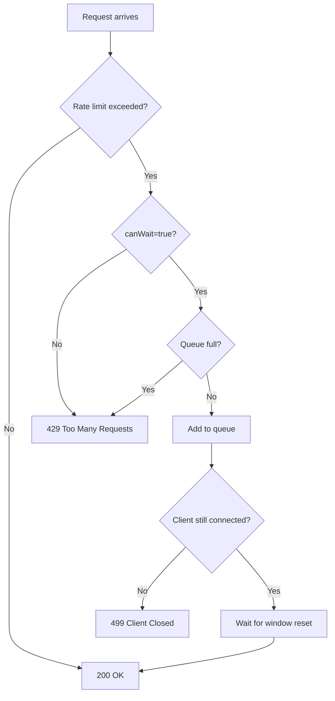

# Response Codes

GoCC uses standard HTTP status codes to indicate the result of rate limiting requests.

## Success Codes

### 200 OK

Request was approved.

**When returned:**
- Rate limit not exceeded
- Request was queued and eventually approved (`?canWait=true`)

**Response body:**

```json
{
  "request_id": "550e8400-e29b-41d4-a716-446655440000"
}
```

## Client Error Codes

### 429 Too Many Requests

Rate limit exceeded and request cannot proceed.

**When returned:**
- Rate limit exceeded AND `canWait=false` (or omitted)
- Rate limit exceeded AND queue is full

**Response body:**

```json
{
  "error": "rate limit exceeded",
  "key": "user-123"
}
```

**Client handling:**

```go
if resp.StatusCode == 429 {
    // Option 1: Retry with exponential backoff
    time.Sleep(backoff)
    return retry()

    // Option 2: Return error to caller
    return errors.New("rate limited")

    // Option 3: Use canWait=true next time
}
```

### 499 Client Closed Request

Client disconnected while waiting in queue.

**When returned:**
- Request was queued (`?canWait=true`)
- Client closed connection before response

**Note:** Clients will never see this code - it's logged server-side.

**Server log:**

```json
{"level":"INFO","msg":"client closed connection","key":"user-123","status":499}
```

## Informational Responses

### Debug Endpoints

Debug endpoints always return 200 with JSON body:

```bash
# GET /debug
{
  "Instances": { ... }
}

# GET /debug/:key (found)
{
  "Key": "user-123",
  "Found": true,
  ...
}

# GET /debug/:key (not found)
{
  "Key": "unknown",
  "Found": false
}
```

### Health Endpoint

```bash
# GET /healthz
# 200 OK
OK
```

## Decision Flowchart



## Response Times

| Scenario | Typical Response Time |
|----------|----------------------|
| Approved immediately | < 1ms |
| Denied immediately | < 1ms |
| Queued and approved | Up to WindowMillis |
| Queued, queue full | < 1ms |

## Retry Strategies

### Exponential Backoff

```go
func rateLimitWithRetry(key string, maxRetries int) error {
    backoff := 100 * time.Millisecond

    for i := 0; i < maxRetries; i++ {
        resp, err := http.Post(
            fmt.Sprintf("http://gocc:8080/rate/%s", key),
            "", nil,
        )
        if err != nil {
            return err
        }

        if resp.StatusCode == 200 {
            return nil
        }

        if resp.StatusCode == 429 {
            time.Sleep(backoff)
            backoff *= 2
            continue
        }

        return fmt.Errorf("unexpected status: %d", resp.StatusCode)
    }

    return errors.New("max retries exceeded")
}
```

### Use Queueing

```go
func rateLimitWithQueue(key string, timeout time.Duration) error {
    ctx, cancel := context.WithTimeout(context.Background(), timeout)
    defer cancel()

    req, _ := http.NewRequestWithContext(
        ctx,
        "POST",
        fmt.Sprintf("http://gocc:8080/rate/%s?canWait=true", key),
        nil,
    )

    resp, err := http.DefaultClient.Do(req)
    if err != nil {
        return err // Includes timeout
    }

    if resp.StatusCode == 429 {
        return errors.New("queue full")
    }

    return nil
}
```

## Monitoring Response Codes

Track response code distribution:

```promql
# Prometheus query
sum(rate(http_requests_total{job="gocc"}[5m])) by (status_code)
```

Expected distribution:
- High 200s: Normal operation
- High 429s: Rate limits being enforced (expected under load)
- Any 5xx: Service issues (investigate immediately)
