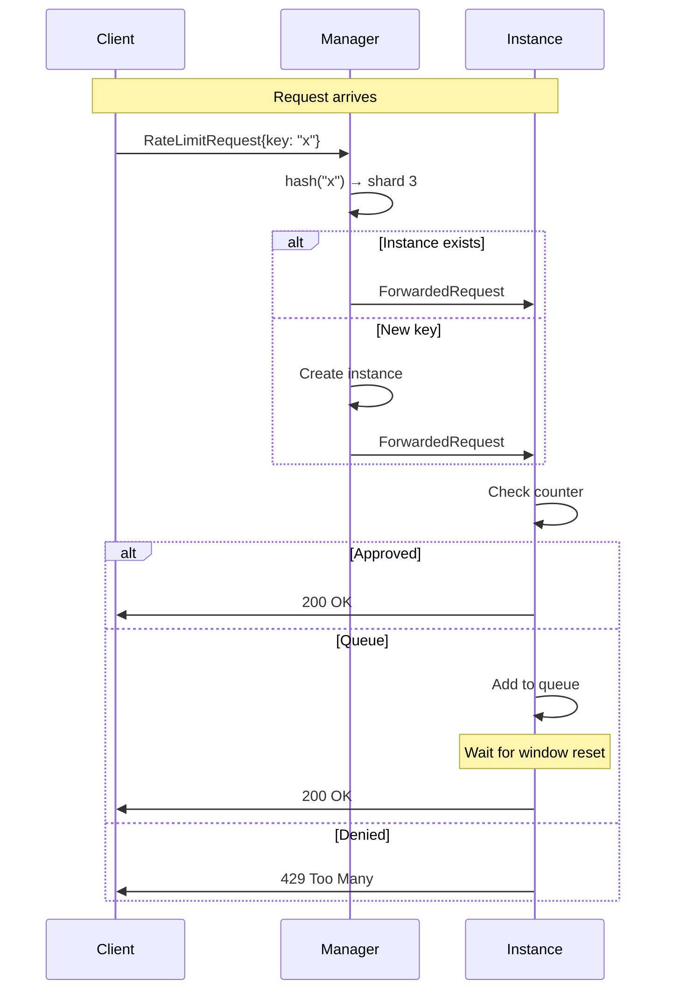

# Actor Model

GoCC uses the actor model for concurrency. Each rate limiter instance is an actor with its own goroutine, state, and message channel.

## What is the Actor Model?

The actor model is a concurrency pattern where:

1. **Actors** are independent units with private state
2. **Messages** are the only way to communicate
3. **No shared state** between actors
4. **Asynchronous** message processing

## Why Actors for Rate Limiting?

### Isolation

Each key's rate limiter is completely isolated:

```
Key "user-1" → Actor 1 (counter: 50, queue: 3)
Key "user-2" → Actor 2 (counter: 100, queue: 0)
Key "user-3" → Actor 3 (counter: 25, queue: 10)
```

No locks needed - each actor manages its own data.

### Scalability

Actors run in parallel:

```
Manager Shard 1  →  key-a actor  →  processing
Manager Shard 2  →  key-b actor  →  processing
Manager Shard 3  →  key-c actor  →  processing
                    (all parallel)
```

### Simplicity

Actor code is sequential:

```go
func (li *LimiterInstance) run() {
    for msg := range li.msgChan {
        switch m := msg.(type) {
        case RateLimitRequest:
            li.handleRequest(m)  // Sequential, no locks
        case WindowTick:
            li.resetWindow()     // Sequential, no locks
        }
    }
}
```

## GoCC's Actor Hierarchy

```
┌─────────────────────────────────────┐
│           HTTP Server               │
└──────────────┬──────────────────────┘
               │
    ┌──────────┼──────────┐
    ▼          ▼          ▼
┌───────┐  ┌───────┐  ┌───────┐
│Shard 1│  │Shard 2│  │Shard n│   Manager Actors
└───┬───┘  └───┬───┘  └───┬───┘
    │          │          │
  ┌─┴─┐      ┌─┴─┐      ┌─┴─┐
  ▼   ▼      ▼   ▼      ▼   ▼
┌───┐┌───┐ ┌───┐┌───┐ ┌───┐┌───┐
│ A ││ B │ │ C ││ D │ │ E ││ F │  Instance Actors
└───┘└───┘ └───┘└───┘ └───┘└───┘
```

### Manager Actors

Responsibilities:
- Route requests to correct instance
- Create instances on demand
- Track and expire idle instances

### Instance Actors

Responsibilities:
- Count requests in current window
- Manage FIFO queue
- Reset on window tick
- Self-expire when idle

## Message Types

### Manager Messages

```go
// Request to rate limit a key
type RateLimitRequest struct {
    Key         string
    CanWait     bool
    ResponseCh  chan RateLimitResponse
}

// Instance reporting expiration
type InstanceExpired struct {
    Key string
}
```

### Instance Messages

```go
// Forwarded rate limit request
type ForwardedRequest struct {
    Request    RateLimitRequest
    ResponseCh chan RateLimitResponse
}

// Window timer tick
type WindowTick struct{}

// Explicit release of a request
type ReleaseRequest struct {
    RequestID string
}
```

## Message Flow Example



## Benefits Over Alternatives

### vs. Mutex-per-Key

```go
// Mutex approach (NOT used)
type RateLimiter struct {
    mu       sync.Mutex
    counters map[string]int
}

func (rl *RateLimiter) Check(key string) {
    rl.mu.Lock()
    defer rl.mu.Unlock()
    // All keys blocked while one is processed
}
```

Problems:
- Global lock = no parallelism
- Complex queue management with locks

### vs. Atomic Counters

```go
// Atomic approach (NOT used)
counters := sync.Map{}  // key → *atomic.Int64
```

Problems:
- Can't implement FIFO queuing
- Can't do complex rate limiting logic
- No per-key configuration

### vs. Database-Backed

```go
// Database approach (NOT used)
db.Exec("UPDATE rate_limits SET count = count + 1 WHERE key = ?", key)
```

Problems:
- Network latency per request
- Database becomes bottleneck
- Complex distributed locking

## Performance Characteristics

### Channel Operations

Go channels have overhead (~50-100ns per operation), but:
- Much faster than network I/O
- Simpler than lock-free algorithms
- Built-in blocking for back-pressure

### Memory

Each actor requires:
- Goroutine stack: ~2KB initial
- Channel buffer: configurable
- State: ~500 bytes

### Throughput

Internal benchmark (no HTTP):
- ~6 million requests/second
- Bottleneck: channel operations

## Comparison with Other Systems

| System | Model | Throughput | Queueing |
|--------|-------|------------|----------|
| GoCC | Actors | 6M/s internal | FIFO |
| Klarna speed_trap (atomics) | Atomics | 10M+/s | No |
| Klarna speed_trap (gen_server) | Actors | 600K/s | Yes |
| Redis rate limiting | Database | 100K/s | Limited |

GoCC trades some raw throughput for:
- FIFO queueing support
- Per-key configuration
- Simple, maintainable code
