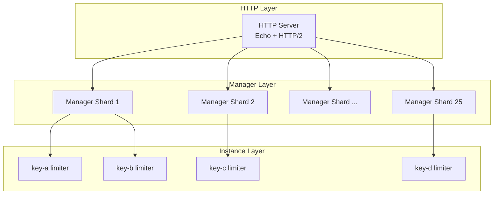
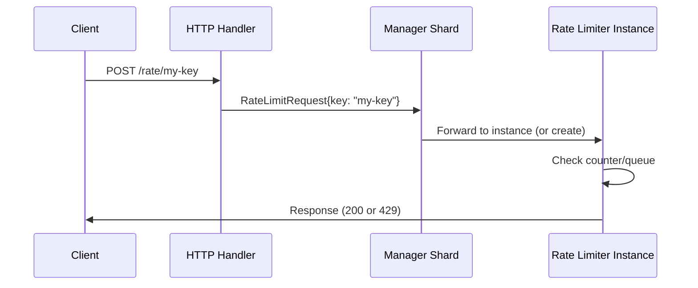
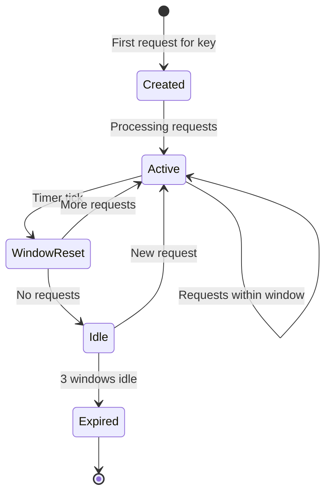

# Architecture

GoCC is built on the actor model, providing isolation, scalability, and simplicity.

## Overview



## Layers

### 1. HTTP Layer

- Echo framework with HTTP/2 support
- Handles request parsing and response formatting
- Routes requests to appropriate manager shard

### 2. Manager Layer

- 25 shards (by default) for parallelism
- Each shard is an independent goroutine
- Routes requests to rate limiter instances
- Creates new instances on demand
- Expires idle instances

**Sharding Algorithm**: FNV-1a hash of key → modulo 25

### 3. Instance Layer

- One goroutine per unique rate limit key
- Maintains request counter and queue
- Resets counter on window tick
- Self-expires after 3 windows of inactivity

## Message Flow



Note: Responses go directly from the instance to the client, bypassing the manager for performance.

## Instance Lifecycle



### Creation

Instances are created lazily on first request:

1. Request arrives for unknown key
2. Manager creates new instance goroutine
3. Instance initializes counter and timer
4. Request is processed

### Window Reset

Every `window_millis` (default 1000ms):

1. Timer fires
2. Counter resets to 0
3. Queued requests are released (FIFO)

### Expiration

After 3 windows with no activity:

1. Instance marks itself for expiration
2. Notifies manager
3. Manager removes from registry
4. Goroutine exits

## Data Structures

### Manager

```go
type LimiterManager struct {
    instances  map[string]*LimiterInstance
    msgChan    chan ManagerMessage
    config     Config
}
```

### Instance

```go
type LimiterInstance struct {
    key                  string
    config               InstanceConfig
    approvedThisWindow   int
    deniedThisWindow     int
    queue                []WaitingRequest
    msgChan              chan InstanceMessage
}
```

## Concurrency Model

### No Shared State

Each actor owns its data:
- Managers own their instance maps
- Instances own their counters and queues

### Message Passing

All communication via channels:
- HTTP handler → Manager: `chan ManagerMessage`
- Manager → Instance: `chan InstanceMessage`
- Instance → Client: Direct response channel

### No Locks in Hot Path

The only synchronization is channel operations:
- Bounded channels provide back-pressure
- No mutexes in request processing

## Sharding

Managers are sharded to reduce contention:

```
Key: "user-123"
     ↓
Hash: FNV-1a("user-123") = 0x7a3b2c1d
     ↓
Shard: 0x7a3b2c1d % 25 = 12
     ↓
Manager 12 handles this key
```

Benefits:
- Parallel processing across shards
- Keys with similar prefixes may hash to different shards
- Consistent routing (same key → same shard)

## Memory Usage

Per instance:
- Fixed overhead: ~500 bytes
- Queue: ~100 bytes per waiting request
- Config: ~50 bytes

Example: 10,000 keys with avg 10 queued requests:
- Instances: 10,000 × 500 bytes = 5 MB
- Queues: 10,000 × 10 × 100 bytes = 10 MB
- Total: ~15 MB

## Distributed Mode

See [Kubernetes Deployment](../operations/kubernetes.md) for multi-instance setup.

In distributed mode:
- Each instance handles a subset of keys
- Consistent hashing routes requests
- No instance-to-instance communication
- Clients can hit any instance (request forwarding)
