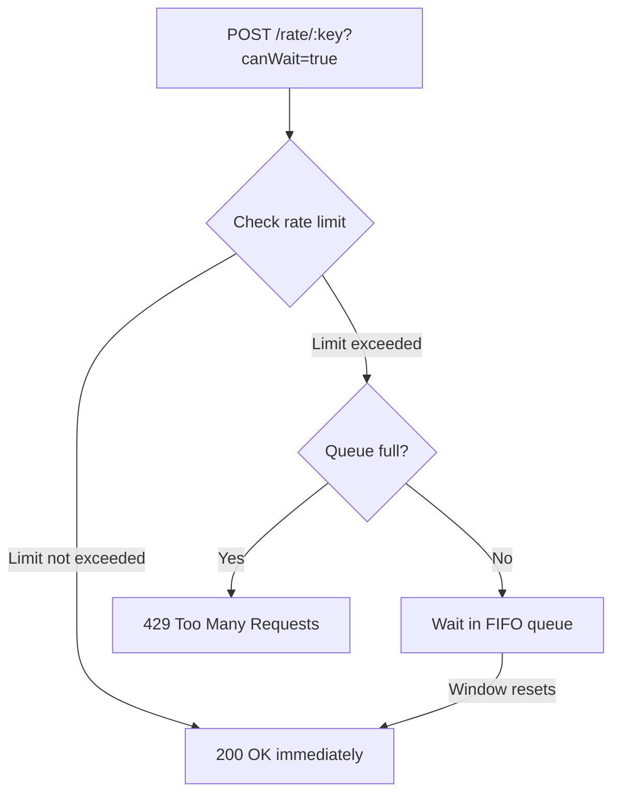

# Queueing

GoCC supports FIFO (First-In-First-Out) queueing for clients that want to wait when rate limited instead of receiving a 429 error.

## How It Works



## Basic Usage

Add `?canWait=true` to wait instead of getting a 429:

```bash
# Without queueing - returns immediately
curl -X POST "http://localhost:8080/rate/my-key"
# 429 Too Many Requests (if limit exceeded)

# With queueing - waits if needed
curl -X POST "http://localhost:8080/rate/my-key?canWait=true"
# Blocks until approved, then returns 200 OK
```

## Queue Configuration

### Global Defaults

```bash
gocc --max-requests 100 --max-requests-in-queue 400
```

This allows:
- 100 requests per window (approved immediately)
- 400 additional requests to wait in queue
- Total: 500 requests can be handled per window

### Per-Key Configuration

In config file:

```json
{
  "keys": [
    {
      "key_pattern": "premium-.*",
      "key_pattern_is_regex": true,
      "max_requests_per_window": 1000,
      "max_requests_in_queue": 5000
    },
    {
      "key_pattern": "free-.*",
      "key_pattern_is_regex": true,
      "max_requests_per_window": 10,
      "max_requests_in_queue": 0
    }
  ]
}
```

### Client-Specified (if allowed)

```bash
curl -X POST "http://localhost:8080/rate/my-key?canWait=true&maxRequestsInQueue=1000"
```

## Queue Behavior

### FIFO Order

Requests are processed in the order they arrive:

```
Time    Action
─────────────────────────────
0ms     Request A arrives → approved (slot 1/100)
1ms     Request B arrives → approved (slot 2/100)
...
100ms   Request X arrives → approved (slot 100/100) - window full
101ms   Request Y arrives → queued (position 1)
102ms   Request Z arrives → queued (position 2)
1000ms  Window resets → Y approved, Z approved
```

### Queue Full

When the queue is full, new requests get 429:

```bash
# Window full + queue full
curl -X POST "http://localhost:8080/rate/my-key?canWait=true"
# 429 Too Many Requests
```

### Timeout Considerations

Clients should set appropriate timeouts:

```bash
# 30 second timeout
curl --max-time 30 -X POST "http://localhost:8080/rate/my-key?canWait=true"
```

If the client disconnects while waiting, GoCC logs a 499 (client closed).

## Monitoring Queues

Check queue status via debug endpoint:

```bash
curl http://localhost:8080/debug/my-key | jq
```

```json
{
  "Key": "my-key",
  "Config": {
    "WindowMillis": 1000,
    "MaxRequestsPerWindow": 100,
    "MaxRequestsInQueue": 400
  },
  "NumApprovedThisWindow": 100,
  "NumDeniedThisWindow": 5,
  "NumWaiting": 47,
  "Found": true
}
```

- `NumWaiting` - Current queue length
- `NumDeniedThisWindow` - Requests that couldn't even queue (queue was full)

## Disabling Queues

To disable queueing entirely:

```bash
gocc --max-requests-in-queue 0
```

Or in config:

```json
{
  "keys": [
    {
      "key_pattern": "no-queue-.*",
      "key_pattern_is_regex": true,
      "max_requests_in_queue": 0
    }
  ]
}
```

## Best Practices

### 1. Size Queues Appropriately

Queue size should reflect:
- Expected burst size
- Acceptable wait time
- Memory constraints (each queued request holds a goroutine)

### 2. Set Client Timeouts

Clients should always have timeouts to avoid hanging indefinitely.

### 3. Monitor Queue Depth

High `NumWaiting` indicates:
- Burst traffic
- Possibly undersized rate limits
- Potential service degradation

### 4. Consider Queue-Free for Strict SLAs

If latency matters more than throughput, disable queues:
- Clients get immediate feedback (429)
- Can implement their own retry logic with backoff
