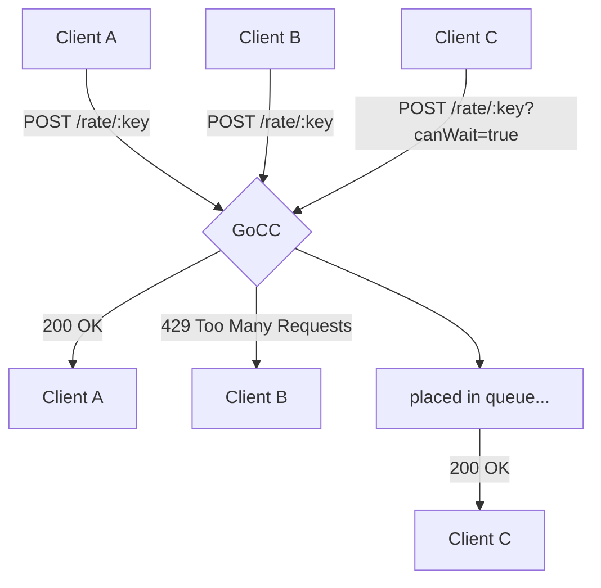
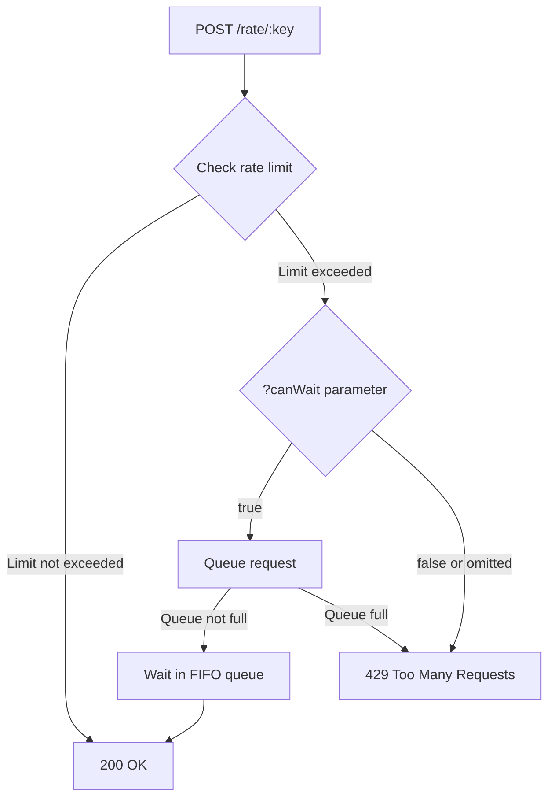

# GoCC - Gopher Cruise Control

**In-memory rate limiter service with FIFO queueing, built on the actor model.**

[](https://github.com/gigurra/gocc/actions/workflows/ci.yml)
[](https://goreportcard.com/report/github.com/gigurra/gocc)

## What is GoCC?

GoCC is a stand-alone rate limiting service that other applications can query via HTTP to check if they're allowed to perform an operation.



## Key Features

- **Fixed time window** rate limiting
- **FIFO queueing** when limits are exceeded
- **Per-key configuration** via JSON config file
- **Hot-reloadable config** - no restart needed
- **Actor model** - one goroutine per key
- **Distributed mode** - Kubernetes StatefulSet support
- **HTTP/2** for better performance

## Quick Start

```bash
# Install
go install github.com/GiGurra/gocc@latest

# Run
gocc

# Test it
curl -X POST http://localhost:8080/rate/my-key
```

## Performance

| Mode | Throughput |
|------|------------|
| Internal (no HTTP) | ~6M req/s |
| HTTP/2 | ~450k req/s |
| HTTP/1.1 | ~80k req/s |

## How It Works



## Origin

Originally developed as a hack project at [Kivra](https://github.com/kivra/gocc), later open-sourced under MIT license by Johan Kjölhede (gigurra).

The exploration of custom transport protocols led to a separate project: [snail](https://github.com/GiGurra/snail) - achieving 300M+ req/s with intelligent batching.

## Next Steps

- [Getting Started](guide/getting-started.md) - Installation and basic usage
- [Configuration](guide/configuration.md) - CLI flags and config files
- [Architecture](design/architecture.md) - How GoCC works internally
- [Deployment](operations/deployment.md) - Production deployment options
